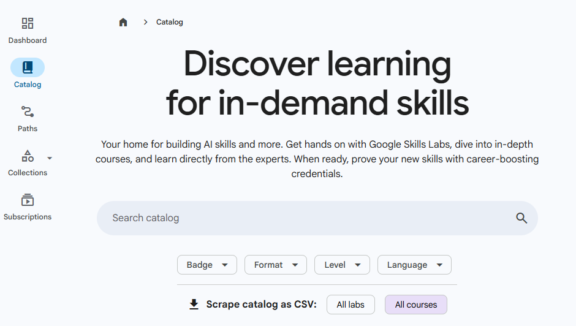

# Qwiklabs Catalog Scraper

This project is a userscript designed to scrape lab and course information from the Google Skills Catalog. It's built using Vite and `vite-plugin-monkey`, allowing it to run as a browser extension/userscript. The script provides functionality to add download links to the catalog page for labs and courses, and also to scrape the catalog data directly, handling pagination and exporting the data as a CSV file.

[](https://www.gnu.org/licenses/gpl-3.0) 

## Features

*   **Download Links:** Adds buttons to the Google Skills Catalog page to directly download lab and course data.
*   **Catalog Scraping:** Automatically navigates through catalog pages, scrapes activity data, and compiles it into a CSV file.
*   **Userscript Integration:** Leverages userscript managers (like Tampermonkey or Violentmonkey) for seamless browser integration.

## Technologies Used

*   **Vite:** A fast build tool for modern web projects.
*   **vite-plugin-monkey:** A Vite plugin for developing userscripts.
*   **JavaScript:** The core language for the scraper logic.

## Installation and Usage

### Prerequisites

*   A userscript manager installed in your browser (e.g., [Tampermonkey](https://www.tampermonkey.net/) or [Violentmonkey](https://violentmonkey.github.io/)).


    [](https://github.com/chriskyfung/qwiklabs-catalog-scraper/releases/latest/download/qwiklabs-catalog-scraper.user.js)

### Building the Userscript

1.  **Clone the repository:**
    ```bash
    git clone https://github.com/chriskyfung/qwiklabs-catalog-scraper.git
    cd qwiklabs-catalog-scraper
    ```
2.  **Install dependencies:**
    ```bash
    npm install
    ```
3.  **Build the userscript:**
    ```bash
    npm run build
    ```
    This will generate the userscript file (e.g., `dist/qwiklabs-catalog-scraper.user.js`).

### Installing the Userscript

1.  Open your userscript manager's dashboard in your browser.
2.  Create a new userscript.
3.  Copy the content of the generated userscript file (`dist/qwiklabs-catalog-scraper.user.js`) and paste it into the new userscript editor.
4.  Save the userscript.

### Running the Scraper

1.  Navigate to the [Google Skills Catalog](https://www.skills.google/catalog) in your browser.
2.  The userscript will automatically activate.
    *   **Download Links:** On the main catalog page, you will see "Scrape catalog as CSV" buttons to download data for labs and courses.
    *   **Direct Scraping:** If you navigate to a specific catalog URL (e.g., one generated by the download links), the script will automatically begin scraping the data and prompt you to download a CSV file once complete.

## Screenshot



## Development

### Development Commands

*   **Development (watch mode):**
    ```bash
    npm run dev
    ```
    This will build the userscript and watch for changes, automatically rebuilding on file modifications.
*   **Linting and Formatting:**
    ```bash
    npm run lint
    ```
    This command runs both ESLint and Prettier to ensure code quality and consistency.
*   **ESLint only:**
    ```bash
    npm run eslint
    ```
*   **Prettier only:**
    ```bash
    npm run prettier
    ```

### Code Structure

*   `src/index.js`: The main entry point of the userscript, handling URL-based logic and userscript menu commands.
*   `src/modules/catalog-page.js`: Contains functions for adding download links to the catalog page.
*   `src/modules/scraper.js`: Implements the core scraping logic, including pagination handling and CSV generation.
*   `src/modules/dom-utils.js`: Provides utility functions for DOM manipulation and data extraction from activity cards.
*   `src/modules/downloader.js`: Handles the client-side download of generated CSV files.

## Contributing

Feel free to open issues or submit pull requests if you have suggestions or improvements.

## License

This project is licensed under the GPL-3.0 License. See the [LICENSE](LICENSE) file for details.
